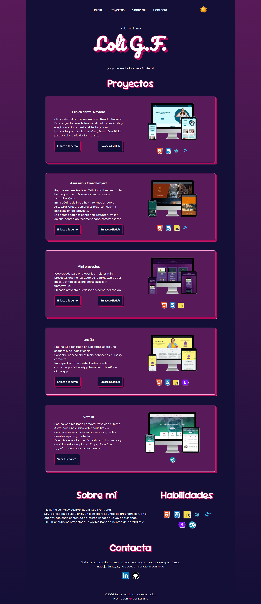

# Portfolio Frontend Developer - Loli Guerrero

      

Este repositorio contiene mi portfolio personal como **Frontend Developer**, donde muestro algunos de los proyectos que he desarrollado utilizando tecnologías modernas del ecosistema web como **JavaScript, React y Tailwind CSS**.

El objetivo del portfolio es presentar mis habilidades en desarrollo frontend, diseño responsive y construcción de interfaces interactivas.

[Demo del portfolio](https://loli-digital.github.io/my-portfolio/)

## Vista previa

---

# Sobre mí

Soy desarrolladora frontend enfocada en la creación de **interfaces web modernas, accesibles y responsive**.

Me interesa el desarrollo de aplicaciones con **React**, la creación de componentes reutilizables y la experiencia de usuario clara y funcional.

Actualmente sigo mejorando mis conocimientos en:

- Arquitectura de aplicaciones con React
- Optimización de rendimiento
- Accesibilidad web
- Testing

---

#  Tecnologías Utilizadas

Este portfolio y los proyectos incluidos han sido desarrollados en:

HTML5 · CSS3 · JavaScript · React · Tailwind CSS · Git · GitHub

---

# Qué puedes encontrar en este portfolio

- Aplicación web desarrollada con **React**
- Interfaces responsive con **Tailwind CSS**
- Formularios con validación
- Componentes reutilizables
- Uso de librerías externas

---

# Proyectos destacados

## Aplicación de reservas para clínica dental (React)

Aplicación web de una clínica dental ficticia que permite consultar servicios, conocer al equipo de profesionales y **reservar cita** a través de un calendario interactivo.

Proyecto desarrollado como aplicación SPA utilizando React y React Router, con gestión de estado mediante React Hooks y persistencia de datos en localStorage.

### Funcionalidades

- Reserva de citas mediante formulario
- Calendario con los horarios de la clínica
- Filtrado de profesionales, según el servicio que se elija
- Validación del formulario
- Gestión de citas guardadas con localStorage
- Eliminación de citas
- Diseño responsive

### Tecnologías

React · React Router · React DatePicker · date-fns · Swiper · Tailwind CSS

[Ver demo](https://calendario-dentista-react.pages.dev/) || [Ver repositorio](https://github.com/loli-digital/calendario-dentista-react)

## Otros proyectos

En el portfolio también se incluyen otros proyectos donde he trabajado aspectos del desarrollo frontend:

- Maquetación responsive
- Diseño de interfaces
- Navegación entre páginas

---

# Habilidades

En este portfolio demuestro mis habilidades en:

- Desarrollo de **Single Page Applications** en React
- Creación de componentes reutilizables
- Gestión de estados con *React Hooks*
- Diseño responsive con **Tailwind CSS**
- Manejo de formularios y validación
- Organización de proyectos frontend
- Control de versiones con *Git* y *GitHub*

---

## Instalación y ejecución

El proyecto es una web estática desarrollada con **HTML, CSS y JavaScript**, por lo que no requiere instalación de dependencias.

Clonar el repositorio:

`git clone https://github.com/loli-digital/my-portfolio.git`

---

## Contacto

[LinkedIn](https://www.linkedin.com/in/loli-guerrero/) || [GitHub](https://github.com/loli-digital)

---

### Atribución

Los emojis se han obtenido de la web [www.thiings.co](https://www.thiings.co/things)